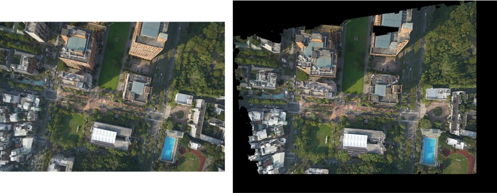

<h1 align="center">Orthorectification_of_Aerial_Image</h1>

An example of orthorectifying aerial image: An aerial image (left) is orthorectified using a digital surface model (DSM), camera interior orientation parameters (IOP), and exterior orientation parameters (EOP), resulting in the corrected image (right).

---
The c# implemataion code for orthorectifying aerial image. It takes a single aerial image as input along with serveral addition data including a digital surface model (DSM), camera interior orientation parameters (IOP), and tie points between original aerial image and orthorectified image. An output orthorectified image is produced after caculation.

## 1. Download images, DSM data
* [Get data in this link]  
Due to large size of these data can not be placed here, please download the data from link below.
https://drive.google.com/drive/folders/1zSH05V19bOMJadYomAqF3LmbOdmuqOZk?usp=sharing

## Run the code
This code needs to be run under .NET core 3.1 environment. This is a window form code. A window will be created after execution, and all subsequent operations can then be performed by clicking buttons.

* **Step 1**  
Press left (開啟) buttun to load image data and display on the left displat box.

* **Step 2**  
Press middle (讀取) buttun to load DSM, EOP data of all images.

* **Step 3**  
Select the EOP of the image to be processed from the combobox.

* **Step 4**  
Press right (轉換) buttun to orthorectify the image. The IOP will be automatically loaded. The orthorectified image will be displayed on the right display box.
